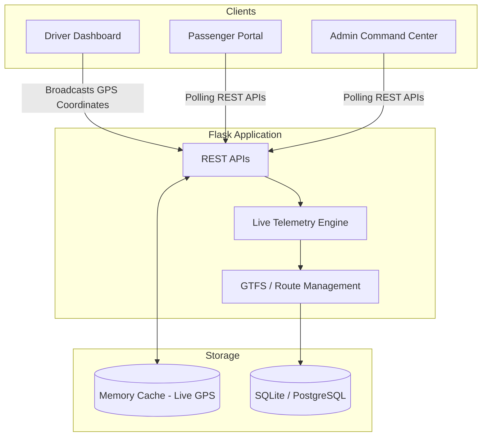

# 🚌 TransPulse

> **"The Pulse of Public Transportation"**

TransPulse is a smart, production-grade public transportation management system designed to orchestrate the lifecycle of public transit. By unifying administrators, drivers, and passengers onto a single cohesive platform, TransPulse modernizes fleet management, enhances operational efficiency, and elevates the commuter experience through real-time telemetry and GTFS schedules data integration.

---

## ✨ Key Features

### 📍 Centralized Live GPS Tracking
- **Dynamic Tracking Visibility**: `tracking_available` flag ensures synchronized visibility. Commuters can only track active buses after a driver starts a trip.
- **Offline Resilience**: Offline banners with automatic polling optimization and live recovery.

### 🛑 Monotonic GTFS Stop Progression
- **Precision Matching**: Real-time closest-stop matching using coordinate Haversine calculations.
- **Timeline Jitter Elimination**: Strict monotonic progression constraint to filter out GPS signal drift.
- **Configurable Radii**: Adjustable stop radius checkpoints (default 30m).

### ⏱️ Blended ETA Engine
- **Smoothed Velocity Formula**: Integrates live speed, historical averages, and scheduled metrics for highly accurate ETA calculations.
- **Smart Adjustments**: Factors in schedule delays and remaining segment distances.

### 🔄 Return Journey Support
- Automatically swaps origin/destination, reverses stop sequences, timeline progression, and map shapes when return trips commence.

### 🗺️ Resilient Map Routing Hierarchy
- Prioritizes GTFS shape rendering and backend road cache. Falls back to client-side OSRM queries or straight stop-to-stop lines during offline scenarios.

### 👥 Interactive Role Dashboards
- **Passenger**: Search routes, check schedules, view delay alerts, track buses, register complaints, and trigger SOS alerts.
- **Driver**: Manage forward/return runs, report occupancy, inspect timelines, and view live traffic maps.
- **Admin**: Dispatch buses, monitor fleet maps, resolve complaints, and manage emergency SOS signals.

---

## 🏛️ System Architecture



---

## 📂 Folder Structure

```text
TransPulse/
├── app.py                      # Application entrypoint & REST API handlers
├── config.py                   # Environment-specific configuration
├── requirements.txt            # Python package dependencies
├── render.yaml                 # Deployment specification
├── README.md                   # Project overview & quickstart index
├── docs/                       # Complete operational documentation
├── models/                     # SQLAlchemy models
├── static/                     # CSS overrides, scripts, map icons
├── templates/                  # Jinja2 responsive templates
├── gtfs_data/                  # Static GTFS schedules directory
├── migrations/                 # Alembic DB migration files
└── tests/                      # Automated unittest suites
```

---

## 🚀 Installation & Setup

### Prerequisites
- Python 3.10+
- pip (Python Package Manager)

### Step-by-Step Guide

1. **Clone the repository:**
   ```bash
   git clone https://github.com/yourusername/transpulse.git
   cd transpulse
   ```

2. **Setup virtual environment:**
   ```bash
   python -m venv .venv
   ```

3. **Activate the environment:**
   - **Windows:** `.venv\Scripts\activate`
   - **Linux/macOS:** `source .venv/bin/activate`

4. **Install required packages:**
   ```bash
   pip install -r requirements.txt
   ```

5. **Configure Environment:**
   Copy the example environment file and update it as needed:
   ```bash
   cp .env.example .env
   ```

6. **Initialize the Database:**
   ```bash
   flask db upgrade
   ```

7. **Ingest GTFS Schedules:**
   ```bash
   flask import-gtfs
   ```

8. **Start Development Server:**
   ```bash
   python app.py
   ```
   *Open [http://localhost:5000](http://localhost:5000) in your browser.*

---

## 📚 Documentation

Dive deeper into TransPulse operations:

- 📖 **[System Documentation Index](docs/README.md)**
- 🛡️ **[Admin Operations Guide](docs/ADMIN_GUIDE.md)**
- 🛞 **[Driver Operations Guide](docs/DRIVER_GUIDE.md)**
- 🎒 **[Passenger User Guide](docs/PASSENGER_GUIDE.md)**
- 🚀 **[Deployment Operations](docs/DEPLOYMENT.md)**
- 🔌 **[API Documentation](docs/API_DOCUMENTATION.md)**
- 📐 **[System Architecture](docs/ARCHITECTURE.md)**
- 🗄️ **[Database Reference Schema](docs/DATABASE_SCHEMA.md)**

---

## 🔮 Future Enhancements
- **FCM Push Alerts:** Real-time ETA updates and SOS event notifications.
- **Machine Learning Analytics:** Advanced delay prediction modeling.
- **GTFS Realtime Integration:** Syncing with external vehicle feeds.
- **Driver Analytics Dashboard:** Monitoring and improving driving patterns.

---

## 📜 License
Distributed under the **MIT License**. See `LICENSE` for details.
