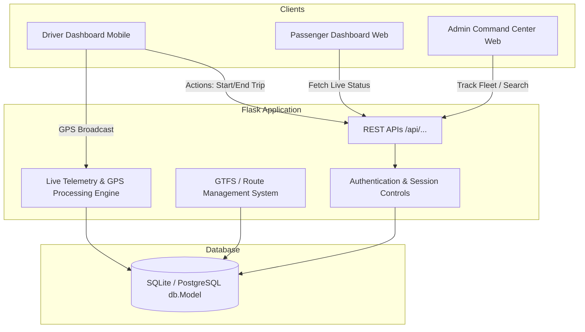
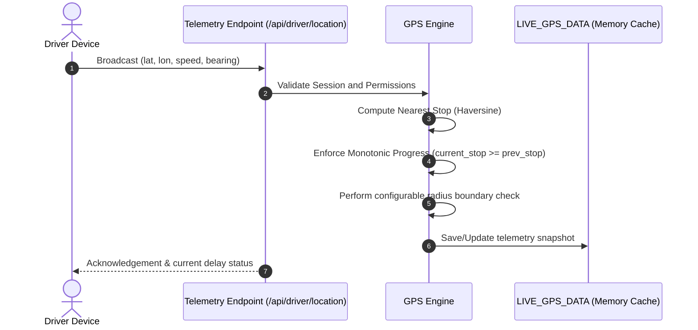
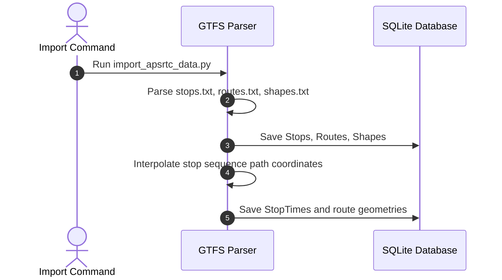
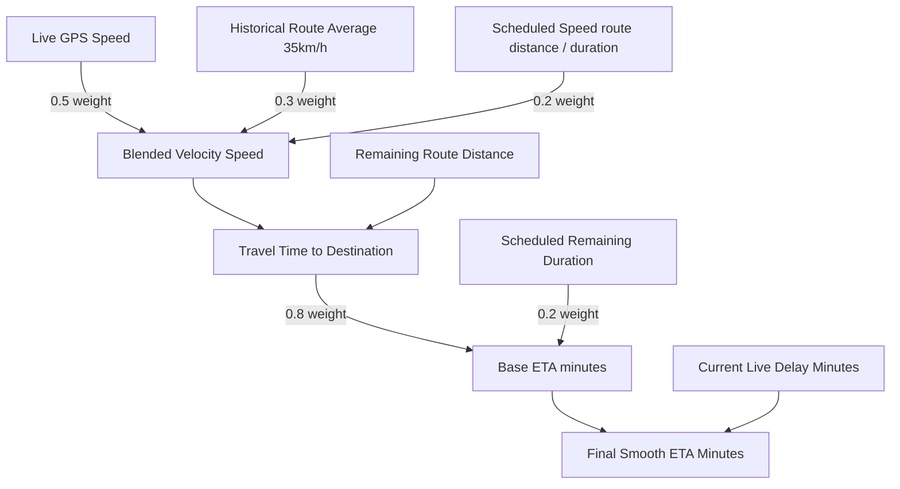
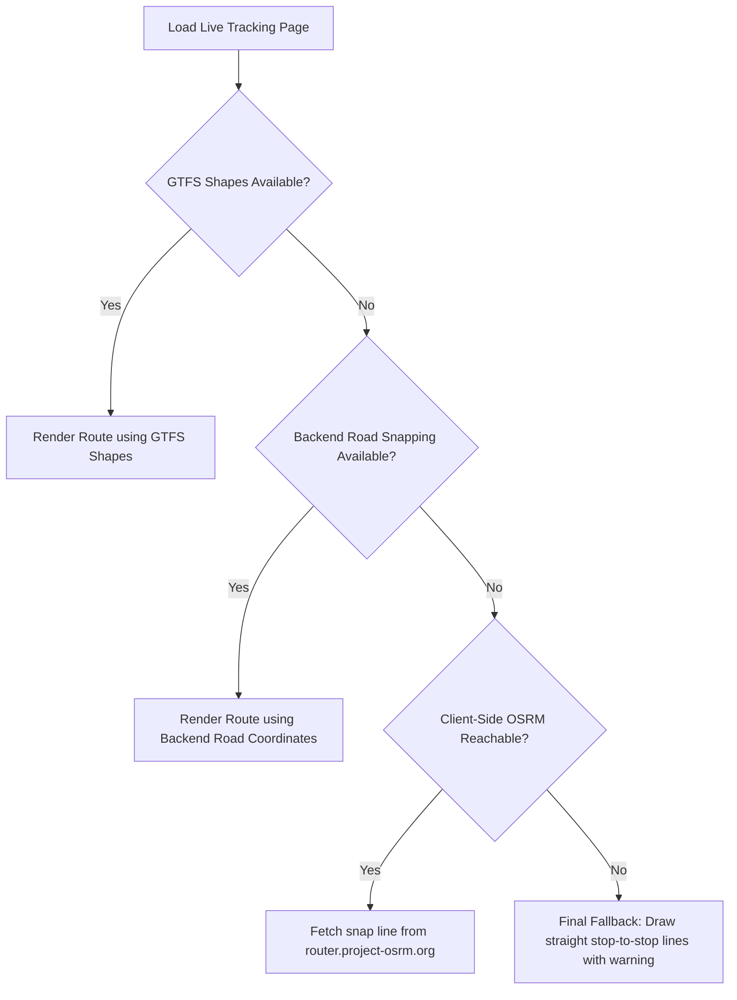
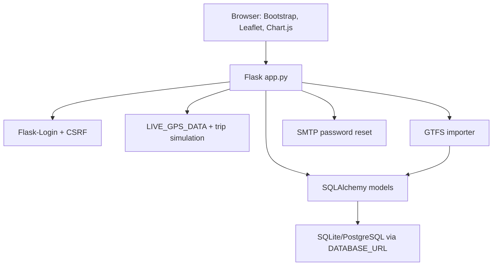

# TransPulse System Architecture

This document describes the high-level system overview, module interactions, request flows, and telemetry processing systems for TransPulse.

---

## 1. System Overview

TransPulse is a live transit tracking system built to synchronize GTFS schedule data with real-time driver GPS coordinates. The application acts as a bridge between transit operations (drivers) and the public (passengers/admins).

---

## 2. Module Interaction

- **Driver Module:** Collects live telemetry from driver devices (lat, lon, speed, bearing) via HTTP POST requests and broadcasts status updates.
- **Passenger Module:** Provides a client-oriented route search, interactive stop timeline, and map tracking screens using Leaflet.js.
- **Admin Module:** Aggregates overall system statistics, live fleet card grids, active operational delays, and interactive search portals.
- **Live GPS Engine:** Computes nearest stop coordinates, tracks monotonic trip progress, checks stop radii, and calculates smoothed blended ETAs.
- **GTFS / Import Engine:** Reads stop sequences, shapes, and journey configurations from standard GTFS imports to populate routes and stops.

---

## 3. Data & Request Flows

### A. Driver GPS Telemetry Flow

### B. GTFS Route Import Flow

### C. Blended ETA Calculation Flow

### D. Tracking Page Resilient Routing Flow

<!-- Merged from PROJECT_ARCHITECTURE.md -->

# Project Architecture

TransPulse is a single-file Flask application for APSRTC public transport operations. The project intentionally keeps route registration, dashboards, APIs, GPS simulation, notifications, SOS, complaints, lost and found, and GTFS helpers in `app.py`.

Key modules:

- `app.py`: routes, APIs, app factory, dashboards, GPS engine, notifications.
- `models/`: SQLAlchemy models and relationships.
- `import_apsrtc_data.py`: batched GTFS ingestion.
- `templates/`: Bootstrap/Jinja dashboards and pages.
- `static/js/`: Leaflet tracking, heatmap, dashboard polling, SOS handling.
- `static/css/`: shared visual styling.

Architecture rule: do not split `app.py` or convert routes to Blueprints unless the project owner explicitly changes that constraint.
