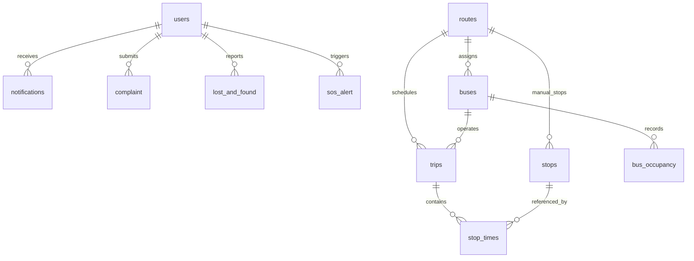

# Database Schema

The application uses SQLAlchemy models with SQLite by default and supports PostgreSQL through `DATABASE_URL`.

Important integrity fields:

- `users.email`, `users.transpulse_id`, and bus driver codes are unique/indexed.
- `routes.route_code` is unique/indexed.
- `trips.gtfs_trip_id` stores the source GTFS trip id for bulk imports.
- `stop_times` is indexed by `(trip_id, stop_sequence)` for schedule and map lookups.
- `bus_occupancy` is indexed by bus/trip timestamp for latest occupancy reads.
- Compatibility migrations in `app.py` add missing columns and indexes to existing SQLite databases.

Known operational note: `db.create_all()` is retained for compatibility. Production deployments should use Flask-Migrate/Alembic migrations for controlled schema evolution.
