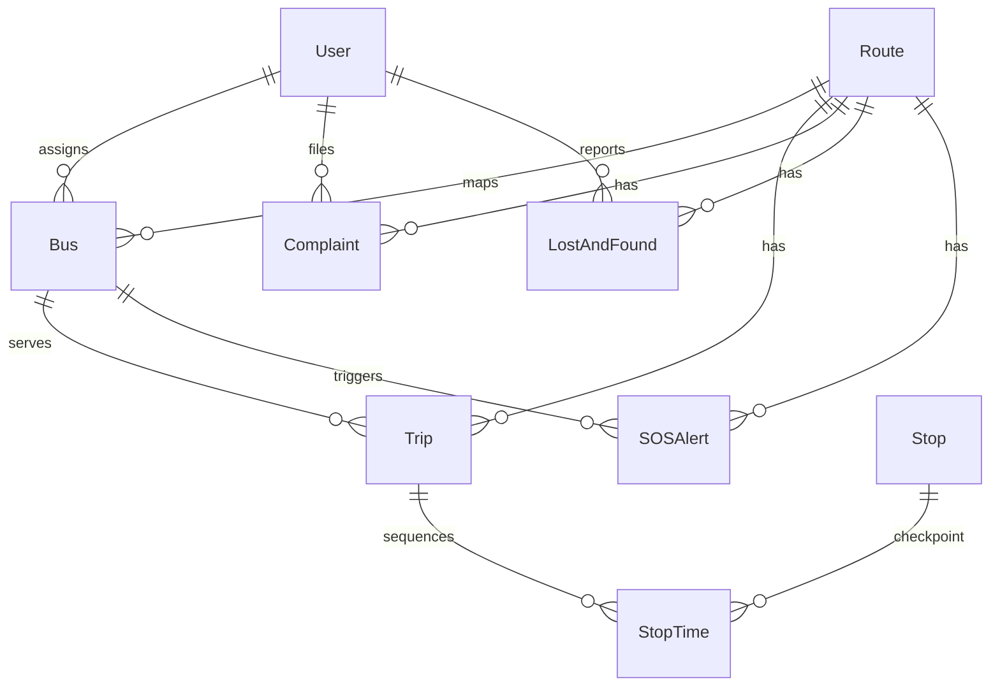

# TransPulse Database Schema

This document details the database models, their fields, and relationships within the TransPulse system.

---

## 1. User & Authorization Roles

### `User` Table
Stores login credentials and roles for Driver, Admin, Passenger, and Auditor accounts.
- **Fields:**
  - `id` (Integer, Primary Key)
  - `username` (String, Unique, Index)
  - `password_hash` (String, Nullable=False)
  - `role` (String, Default="passenger") - Enforced values: `admin`, `driver`, `passenger`, `auditor`
  - `driver_code` (String, Unique, Nullable=True) - Assigned to drivers
  - `created_at` (DateTime)

---

## 2. Transit Network & GTFS Infrastructure

### `Bus` Table
Represents a physical vehicle in the fleet.
- **Fields:**
  - `id` (Integer, Primary Key)
  - `bus_number` (String, Unique, Index)
  - `registration_number` (String, Unique)
  - `route_id` (Integer, ForeignKey to `Route.id`)
  - `assigned_driver_id` (Integer, ForeignKey to `User.id`)
  - `is_active` (Boolean, Default=True)
- **Relationships:**
  - `route` (Many-to-One with `Route`)
  - `driver` (Many-to-One with `User`)

### `Route` Table
Corresponds to a GTFS route mapping.
- **Fields:**
  - `id` (Integer, Primary Key)
  - `route_code` (String, Unique, Index)
  - `name` (String)
  - `origin` (String)
  - `destination` (String)
  - `distance_km` (Float)
  - `departure_time` (String)
  - `arrival_time` (String)
  - `is_operational` (Boolean)
- **Relationships:**
  - `stops` (One-to-Many with `Stop`)
  - `trips` (One-to-Many with `Trip`)
  - `buses` (One-to-Many with `Bus`)

### `Trip` Table
Represents a scheduled or active dispatch of a Route.
- **Fields:**
  - `id` (Integer, Primary Key)
  - `route_id` (Integer, ForeignKey to `Route.id`)
  - `bus_id` (Integer, ForeignKey to `Bus.id`)
  - `service_id` (String)
  - `trip_id` (String, Unique)
  - `trip_headsign` (String)
  - `direction_id` (Integer) - `0` for Forward, `1` for Return
  - `shape_id` (String)
  - `start_time` (DateTime)
  - `end_time` (DateTime)
  - `status` (String) - `waiting_to_depart`, `active`, `completed`, `return_ready`, `return_running`, `return_completed`
- **Relationships:**
  - `route` (Many-to-One with `Route`)
  - `bus` (Many-to-One with `Bus`)

### `Stop` Table
Stores geographical checkpoints.
- **Fields:**
  - `id` (Integer, Primary Key)
  - `stop_id` (String, Unique)
  - `stop_code` (String)
  - `stop_name` (String)
  - `stop_desc` (String)
  - `stop_lat` (Float)
  - `stop_lon` (Float)
  - `zone_id` (String)
- **Relationships:**
  - `route_stops` (One-to-Many with `StopTime`)

### `StopTime` Table
Maps the ordered sequence of Stops for a Trip.
- **Fields:**
  - `id` (Integer, Primary Key)
  - `trip_id` (Integer, ForeignKey to `Trip.id`)
  - `stop_id` (Integer, ForeignKey to `Stop.id`)
  - `arrival_time` (String)
  - `departure_time` (String)
  - `stop_sequence` (Integer)
- **Relationships:**
  - `trip` (Many-to-One with `Trip`)
  - `stop` (Many-to-One with `Stop`)

### `Shape` Table
Stores coordinates forming the line path of a route.
- **Fields:**
  - `id` (Integer, Primary Key)
  - `shape_id` (String, Index)
  - `shape_pt_lat` (Float)
  - `shape_pt_lon` (Float)
  - `shape_pt_sequence` (Integer)
  - `shape_dist_traveled` (Float)

---

## 3. Operations & Support

### `Complaint` Table
Passenger complaints.
- **Fields:**
  - `id` (Integer, Primary Key)
  - `user_id` (Integer, ForeignKey to `User.id`)
  - `route_id` (Integer, ForeignKey to `Route.id`)
  - `bus_id` (Integer, ForeignKey to `Bus.id`)
  - `category` (String)
  - `description` (Text)
  - `status` (String)
  - `created_at` (DateTime)

### `Notification` Table
System broadcasts or alert notifications.
- **Fields:**
  - `id` (Integer, Primary Key)
  - `title` (String)
  - `message` (Text)
  - `is_read` (Boolean)
  - `created_at` (DateTime)

### `LostAndFound` Table
Reports for items lost during trips.
- **Fields:**
  - `id` (Integer, Primary Key)
  - `user_id` (Integer, ForeignKey to `User.id`)
  - `route_id` (Integer, ForeignKey to `Route.id`)
  - `item_name` (String)
  - `description` (Text)
  - `status` (String) - `reported`, `found`, `claimed`
  - `created_at` (DateTime)

### `SOSAlert` Table
Emergency signals triggered by passengers/drivers.
- **Fields:**
  - `id` (Integer, Primary Key)
  - `bus_id` (Integer, ForeignKey to `Bus.id`)
  - `route_id` (Integer, ForeignKey to `Route.id`)
  - `lat` (Float)
  - `lon` (Float)
  - `status` (String)
  - `created_at` (DateTime)

---

## 4. Entity Relationship Diagram

