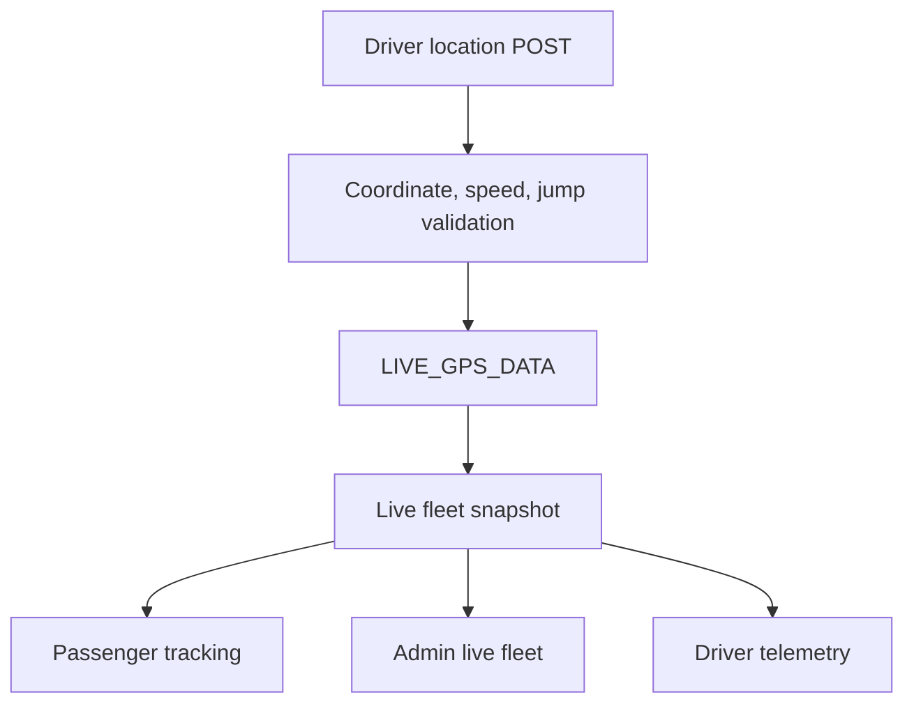

# GPS Engine

Live driver GPS is held in `LIVE_GPS_DATA` and exposed through the live bus APIs. Simulated movement uses GTFS stops/shapes and trip state when real driver coordinates are not fresh.

Key behaviors:

- Stale GPS packets are ignored by `_fresh_gps_packet`.
- Driver trip start/end clears stale live GPS state.
- Passenger tracking heartbeats are recorded by `/api/tracking/session`.
- Delay reports update ETA, schedule labels, and notifications.
- Completed trips can still be rendered briefly through `/api/tracking/completed/<bus_identifier>`.

Operational limits:

- In-memory GPS state is process-local. Multi-worker production deployments need Redis or another shared store.
