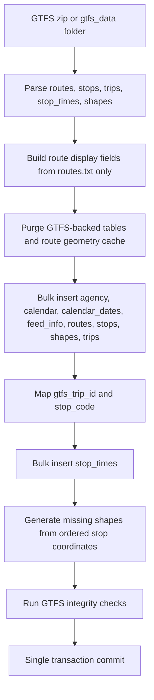

# GTFS Integration Guide

TransPulse is deeply integrated with the General Transit Feed Specification (GTFS). Instead of hardcoding routes or mapping data manually, TransPulse automatically maps abstract schedule data into living, tracking geometry.

## GTFS Files Used

### `agency.txt`
Identifies the operating transit agency. Currently hardcoded in the parser to validate basic dataset integrity.

### `routes.txt`
Defines the distinct lines (e.g., Route 1, Route 21). TransPulse imports these into the `Route` model, extracting the `route_id`, `route_short_name`, and `route_long_name`.

### `trips.txt`
Links a route to a specific sequence of stops. Used to ascertain the direction of travel (`direction_id`). TransPulse groups shape parameters dynamically based on these static trips.

### `stops.txt`
Contains the precise physical coordinates of bus stops. TransPulse uses this to anchor the map UI and mathematically detect when a bus has successfully "arrived" at a designated station.

### `stop_times.txt`
Dictates the sequence of stops and the expected arrival/departure times. TransPulse ingests these into the `StopTime` model to construct the Driver Dashboard sequence and the Passenger tracking timeline. 

### `shapes.txt`
Provides the high-fidelity polyline geometry outlining the physical road path of the route. TransPulse serializes this into a JSON array, serving it securely to Leaflet.js to draw the blue tracking line on the maps.

### `calendar.txt` & `calendar_dates.txt`
Provides service availability. Handled implicitly via the standard GTFS constraints logic.

## Import Process
The command `flask import-gtfs` performs a non-destructive teardown and rebuild of the static topology:
1. Clears existing static models.
2. Ingests stops, routes, and shapes.
3. Assembles trips and stop_times.
4. Leaves live state data (Buses, dynamic Trips) untouched to prevent catastrophic live-system failure during a schedule update.

<!-- Merged from GTFS_IMPORT.md -->

# GTFS Import

The CLI command `flask import-gtfs` calls `process_extracted_gtfs()` in `import_apsrtc_data.py`.

Supported files:

- `agency.txt`
- `calendar.txt`
- `routes.txt`
- `trips.txt`
- `stops.txt`
- `stop_times.txt`
- `shapes.txt`
- `calendar_dates.txt`
- `feed_info.txt`

Performance notes:

- Inserts are batched with `bulk_insert_mappings`.
- `trips.gtfs_trip_id` avoids per-trip flush loops.
- Stop time lookups use in-memory source maps and database indexes.
- `StopTime` is the authoritative route-stop ordering source.
- `Route.origin` and `Route.destination` are display-only fields and never reject assignments.
- Generated shapes are invalidated and rebuilt when GTFS is re-imported because `road_geometry_cache` is purged.
- Import failures rollback the transaction and log exception details.
