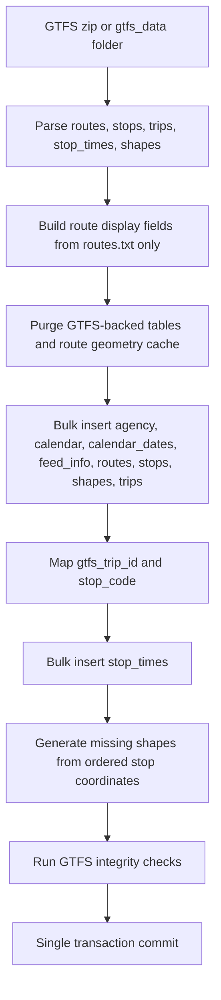

# GTFS Import

The CLI command `flask import-gtfs` calls `process_extracted_gtfs()` in `import_apsrtc_data.py`.

Supported files:

- `agency.txt`
- `calendar.txt`
- `routes.txt`
- `trips.txt`
- `stops.txt`
- `stop_times.txt`
- `shapes.txt`
- `calendar_dates.txt`
- `feed_info.txt`

Performance notes:

- Inserts are batched with `bulk_insert_mappings`.
- `trips.gtfs_trip_id` avoids per-trip flush loops.
- Stop time lookups use in-memory source maps and database indexes.
- `StopTime` is the authoritative route-stop ordering source.
- `Route.origin` and `Route.destination` are display-only fields and never reject assignments.
- Generated shapes are invalidated and rebuilt when GTFS is re-imported because `road_geometry_cache` is purged.
- Import failures rollback the transaction and log exception details.
