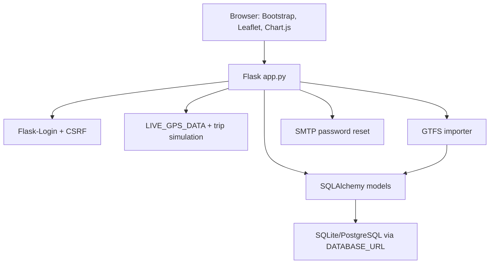

# Project Architecture

TransPulse is a single-file Flask application for APSRTC public transport operations. The project intentionally keeps route registration, dashboards, APIs, GPS simulation, notifications, SOS, complaints, lost and found, and GTFS helpers in `app.py`.

Key modules:

- `app.py`: routes, APIs, app factory, dashboards, GPS engine, notifications.
- `models/`: SQLAlchemy models and relationships.
- `import_apsrtc_data.py`: batched GTFS ingestion.
- `templates/`: Bootstrap/Jinja dashboards and pages.
- `static/js/`: Leaflet tracking, heatmap, dashboard polling, SOS handling.
- `static/css/`: shared visual styling.

Architecture rule: do not split `app.py` or convert routes to Blueprints unless the project owner explicitly changes that constraint.
