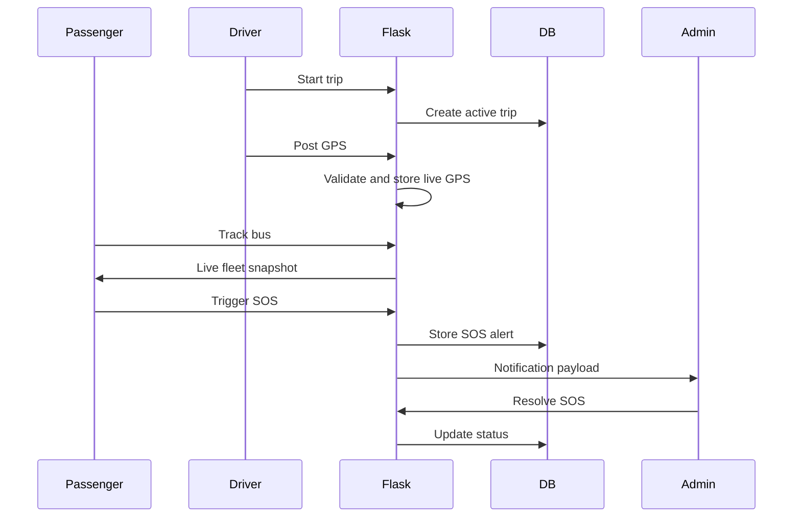

# System Flow

Dashboard flow:

- Admin views fleet, heatmap, analytics, SOS, complaints, and management pages.
- Driver manages assigned bus trip lifecycle, GPS, occupancy, delays, reports, and alerts.
- Passenger searches routes, tracks buses, receives notifications, and submits SOS/complaints/lost-and-found reports.
